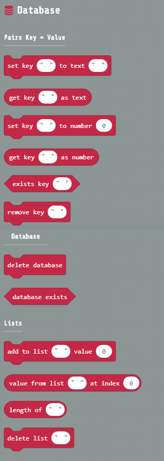

# pxt-arcade-databse 

## Description

You can store data **key=>value** in your console flash memory

Also you can create lists of data

## Blocks preview

## Supported targets

* for PXT/arcade
* for PXT/arcade
(The metadata above is needed for package search.)

